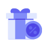
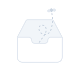

# Illustration

Three illustration sets, each tied to a specific product context. **Use these real exported files directly — don't recreate an illustration from a text description**, same policy as [Logo](logo.md).

Figma: [`📱 Illustration`](https://www.figma.com/design/YFci6zgeYAQqX2OlHKQB0e) page.

## Request type

Used for request types across the platform (e.g. the request list, request detail header). One illustration per request-type code, plus a fallback. **Confirmed rule: any request type without its own dedicated illustration — including new request types added later — uses the Default Doc variant.** This covers `ITR`, `PTR`, and any future type, not just the ones already known to be missing.

| Code | Use | File |
|---|---|---|
| ADV | Advance Request |  [`request-type-adv.svg`](../assets/illustrations/request-type-adv.svg) |
| CLR | Clear Advance Request |  [`request-type-clr.svg`](../assets/illustrations/request-type-clr.svg) |
| GEN | General |  [`request-type-gen.svg`](../assets/illustrations/request-type-gen.svg) |
| MMB | My Mix Benefit |  [`request-type-mmb.svg`](../assets/illustrations/request-type-mmb.svg) |
| MRR | Material/Service Request *(confirmed by design owner — Figma component renamed from `MMR`, a typo)* |  [`request-type-mrr.svg`](../assets/illustrations/request-type-mrr.svg) |
| PAY | Payment Request |  [`request-type-pay.svg`](../assets/illustrations/request-type-pay.svg) |
| PET | Petty Cash Request |  [`request-type-pet.svg`](../assets/illustrations/request-type-pet.svg) |
| PO | Purchase Order |  [`request-type-po.svg`](../assets/illustrations/request-type-po.svg) |
| PO_BC | Purchase Order (Blanket Contract) *(name inferred from code, unconfirmed)* |  [`request-type-po-bc.svg`](../assets/illustrations/request-type-po-bc.svg) |
| PR-EAP | Purchase Request |  [`request-type-pr-eap.svg`](../assets/illustrations/request-type-pr-eap.svg) |
| PROJ | Project Request |  [`request-type-proj.svg`](../assets/illustrations/request-type-proj.svg) |
| RMB | Reimbursement Request *(confirmed by design owner)* |  [`request-type-rmb.svg`](../assets/illustrations/request-type-rmb.svg) |
| — | Default Doc — fallback for any type without its own illustration (confirmed, including future new request types) |  [`request-type-default-doc.svg`](../assets/illustrations/request-type-default-doc.svg) |

## General

| Use | File |
|---|---|
| Widget customization on the home page |  [`widget-general.svg`](../assets/illustrations/widget-general.svg) |

## Outlined (empty states)

**Only 1–2 of this set are actually in use** — per explicit scoping from the user, this is not a fully-adopted illustration library yet. The Figma page originally had 61 numbered candidates (`1`–`61`, plus one instance override); the user has since trimmed the page down to just the one currently shipping.

| Use | File |
|---|---|
| Generic empty state (empty box/inbox) |  [`empty-state-box.svg`](../assets/illustrations/empty-state-box.svg) |

## Behavior rules

- **Always reference the exported SVG files above** — same rationale as [Logo](logo.md): reconstructing an illustration from a description is how the wrong artwork ends up in a vibe-coded page.
- **Request type illustrations are keyed by the request-type code**, not by a generic "document" concept — always pick the illustration matching the specific type being displayed.
- **Any request type without its own dedicated illustration uses Default Doc** — confirmed by the design owner. This is the standing rule for gaps in the current set (`ITR`, `PTR`) and for any new request type added in the future that doesn't get a custom illustration commissioned for it. Don't invent a new illustration or reuse an unrelated one — Default Doc is the correct fallback by design, not a stopgap.
- **Illustration artwork colors are fixed, not token-driven** — like Logo's brand mark, these are deliberate raw fills (not bound to this system's semantic color tokens), and shouldn't be recolored via token substitution.

## Known gaps (component doesn't yet match spec, or naming is inconsistent)

- **`PO_BC`'s expansion is inferred from the code alone** ("Blanket Contract" is a guess based on common purchase-order terminology) — not confirmed with the design owner.
- **The Outlined/empty-state set was reduced from 61 candidates to 1 by the user mid-audit** — the remaining asset's Figma layer is still just named `"36"` (its original number in the unused set), not a descriptive name. Flagged, not renamed without confirmation.
- **The empty-state illustration's line/fill colors are bound to a `slate/*` variable scale** (`slate/100`, `slate/200`, `slate/300`) — a different, blue-tinted gray ramp than this system's own neutral gray tokens (`text+icon/tertiary`, `border/primary`, etc. are pure neutral, no blue tint). Left unbound/unfixed per the "illustration colors are fixed" rule above, but flagging the inconsistent source in case the design owner wants it consolidated onto the system's own gray scale for visual consistency.

## Changelog

- **User-confirmed code mapping (2026-08-19):** the correct code for the (renamed) `MMR` asset is `MRR` (Material/Service Request) — a letter-transposition typo, fixed in Figma and in the exported filename (`request-type-mrr.svg`). `RMB` was then separately confirmed as Reimbursement Request, a real, distinct code — not a duplicate of `MRR` as briefly suspected. Both are now fully resolved in the table above.
- **User-confirmed fallback rule (2026-08-19):** any request type without its own illustration — `ITR`, `PTR`, and any new request type added later — uses Default Doc. Previously flagged as inferred/unconfirmed; now a documented standing rule.
- **Page rearranged by the user mid-audit (2026-08-19):** the original `Outlined` frame (61 numbered illustration candidates) and a `Company_Logo` frame (unrelated client-logo examples, out of Illustration's scope) were removed; a new `Illustration - Empty` frame with just the 1 illustration actually in use replaced them. Docs and exports reflect the post-rearrangement state only.
- **Exported 15 real SVG assets** (2026-08-19): 12 request-type illustrations + 1 fallback, 1 general/widget illustration, 1 empty-state illustration — saved to `docs/assets/illustrations/`.
- Fixed a **bare-numbered-name spacing token** (a variable literally named `"16"` instead of `spacing/16`, same value `64px`, wrong source — same pattern seen on [navigation bar](nav-mobile-top-bar.md)) on the Request type and General Content frames.
- No fixes applied to illustration artwork fills — per the "illustration colors are fixed" rule, consistent with [Logo](logo.md)'s precedent, except where flagged above as worth a future design-owner decision.
- Documented anatomy and usage rules for the first time — this page previously had no doc. Usage context (which set maps to which feature) confirmed directly by the user rather than inferred.
