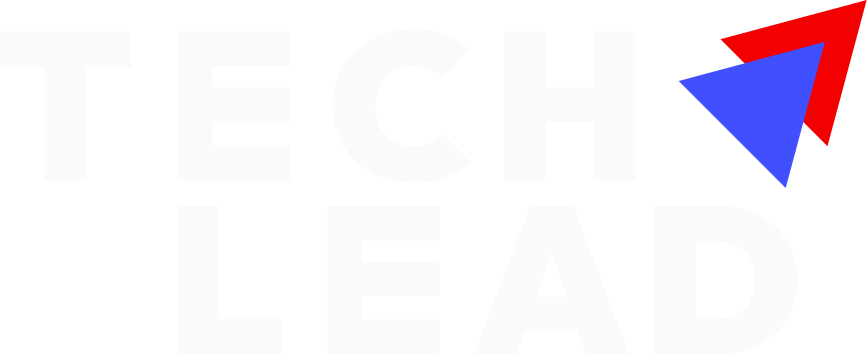

# Logo

The Tech Lead brand mark and wordmark lockup, plus a compact icon-only mark for tight spaces (e.g. the sidebar's [Workspace menu](nav-workspace-menu.md)).

Figma: [`📱 Logo`](https://www.figma.com/design/YFci6zgeYAQqX2OlHKQB0e) page. Real asset files are exported below — **use these files directly, don't recreate the mark from a text description.**

## Assets

| Asset | Use | File |
|---|---|---|
| Wordmark, for dark/colored backgrounds | Text renders near-white (`#FAFAFA`) |  [`docs/assets/logo/techlead-wordmark-on-dark.svg`](../assets/logo/techlead-wordmark-on-dark.svg) |
| Wordmark, for light backgrounds | Text renders solid black |  [`docs/assets/logo/techlead-wordmark-on-light.svg`](../assets/logo/techlead-wordmark-on-light.svg) |
| Compact mark (icon only) | Tight spaces — sidebar, favicon-scale UI |  [`docs/assets/logo/techlead-mark.svg`](../assets/logo/techlead-mark.svg) |

*(If the inline previews above don't render for you, open the linked `.svg` files directly — GitHub and most Markdown viewers render SVGs inline.)*

## Anatomy

| Part | Value |
|---|---|
| Mark — two overlapping triangles | Red `#F30000` (top) over indigo `#4150FF` (bottom) — fixed brand colors, not bound to system color tokens (same treatment as OS chrome, see [`DESIGN.md`](../../DESIGN.md) §1 — brand identity colors don't theme-swap) |
| Wordmark text color | Swaps by background: `#FAFAFA` (near-white, on dark) / `#000000` (black, on light) — the "on dark" variant is also partially bound to `text + icon/primary-inverse`, correctly treating it as theme-aware UI text rather than fixed brand color |
| Compact mark's two triangles | Bound to `text + icon/danger-bolder` (red) and `text + icon/brand` (indigo) — see Known gaps for the semantic-naming concern |

## Variants

Figma component property is named `Property 1` (`Dark` / `Light`) — describes the **background the logo sits on**, not the logo's own color scheme. `Property 1=Dark` → use the near-white wordmark (the "on dark" export above). `Property 1=Light` → use the black wordmark (the "on light" export above). Flagged in Known gaps: this naming is easy to misread as "the dark-colored version" when it actually means the opposite (the version *for* dark backgrounds).

## Behavior rules

- **Always use the exported SVG files above, never redraw or approximate the mark** — this is the exact problem this doc exists to prevent. If a vibe-coding tool needs the logo, point it at `docs/assets/logo/*.svg`, don't describe the shape in a prompt.
- **Pick the wordmark variant by background darkness**, not by any other context — near-white wordmark on dark/colored surfaces, black wordmark on light/white surfaces.
- **The compact mark (`techlead-mark.svg`) is for space-constrained UI** — used today in the sidebar's workspace switcher at 24×24px. It's the two triangles only, no wordmark.
- **Proposed, not confirmed with design owner:** maintain clear space around the logo equal to roughly the height of one triangle, and don't scale the wordmark below ~80px wide (readability floor for the lettering strokes). These are standard logo-usage defaults, not values found explicitly documented in Figma — flagged as a proposal, not fact.

## Known gaps (component doesn't yet match spec, or naming is inconsistent)

- **`Property 1=Dark`/`Light` names describe the background the logo sits on, not the logo's own appearance** — genuinely ambiguous naming, worth a rename (e.g. `Background=Dark`/`Light`) but not renamed without confirmation.
- **The compact mark's triangle colors are bound to `text + icon/danger-bolder` (red) and `text + icon/brand` (indigo)** — reusing a danger/error-semantic token for a decorative brand-mark color is a naming/semantic mismatch, even though the rendered color is correct. Flagged, not rebound — touching a logo's actual color is exactly the kind of change that shouldn't happen without explicit confirmation.
- **A separate `Company Logo` component set exists on this page** (10 example variants: Techlead, Nestify, MarDEE, PayGenix, etc.) — this looks like a swappable per-workspace/tenant logo slot populated with example filler logos, not part of this system's own brand identity. Out of scope for this pass; flagging in case it needs its own documentation as a "logo slot" pattern (with real tenant logos supplied per-workspace, not fixed assets to export).
- No sizing/clear-space/minimum-size rule is explicitly documented in Figma — the rules above are proposed defaults, not confirmed.

## Changelog

- **Exported real SVG assets** for the first time in this audit (2026-08-19) — `techlead-wordmark-on-dark.svg`, `techlead-wordmark-on-light.svg`, `techlead-mark.svg`, saved to `docs/assets/logo/`. This directly addresses a stated pain point: vibe-coding tools reconstructing the logo from a text description rather than using the real asset.
- No token-binding fixes made — the mark's brand colors are intentionally fixed/unbound (correct), and the wordmark's theme-aware text color was already correctly bound where it should be. This component was effectively "clean" going in.
- Documented anatomy, variants, and usage rules for the first time — this component previously had no doc.
